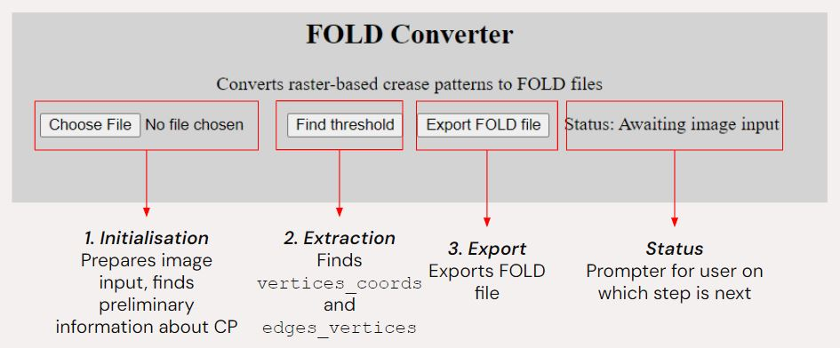
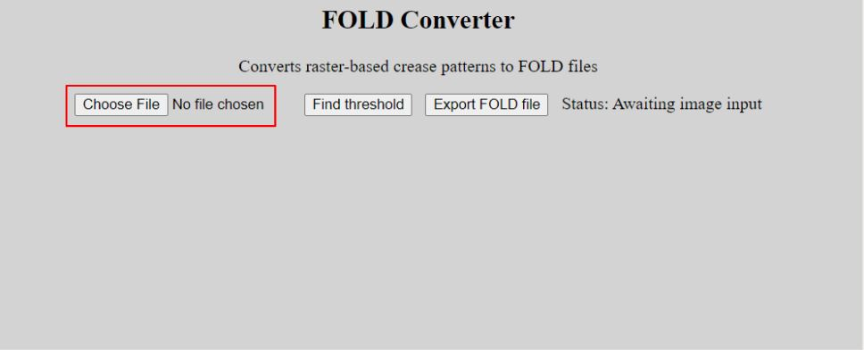
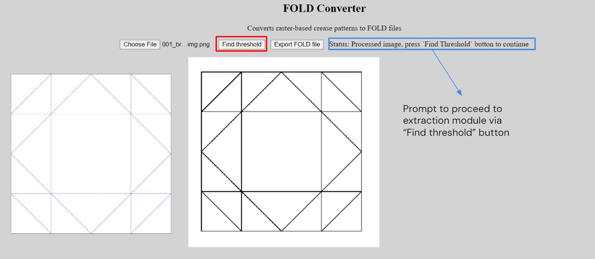
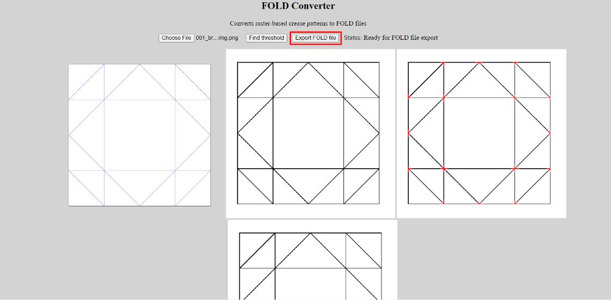

# FYP Project 
Hello! This is my final year project (FYP) which aims to extract origami crease patterns from images into the [FOLD file format](https://github.com/edemaine/fold), making it easier to analyse them using existing computational origami software. The web application can be found here: [FOLD Converter](https://lynnhow.github.io/fyp/).

## Video Demonstration
The following video shows a demonstration of the steps needed to use FOLD Converter.

https://github.com/lynnhow/fyp/assets/153375579/30cae931-e941-4c9d-b24e-5015c147dc17

## How to use FOLD Converter
1. Open [FOLD Converter](https://lynnhow.github.io/fyp/).
    - The interface should look like the image below
    - FOLD Converter consists of 3 main sections, which are also highlighted

2. Upload your crease pattern image

    - Click on the "Choose File" button and select your file
    - FOLD Converter can only process raster images (.jpg, .png etc.)
    - Sample crease patterns can be found in the [examples folder](examples)

3. Extracting crease pattern information

     - After uploading your crease pattern, the interface should look something like the above image
         - The first image is the original image, and the second image is a black and white version of the image
     - Click on the "Find threshold" button to extract the necessary properties of the CP
         - This process may take a while, as FOLD Converter will try to find the right number of vertices in the image

4. Export FOLD file

    - Once the extraction process has finished, FOLD Converter will display two additional images
        - The third image is the crease pattern with all possible vertex pixels changed to red
        - The fourth image shows the final pixel determined for each vertex, which are changed to red
    - You can now export the image using the "Export FOLD file" button, which will automatically start downloading the FOLD file of your original image

